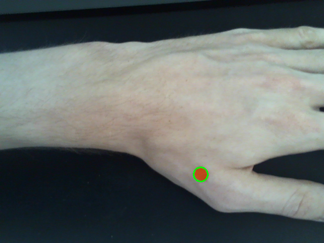

# Red circle detection using OpenCV

This is an example of detecting a red circle in images obtained from a camera. This could be used to detect a circular red reference object in an image and subsequently calculate the size of objects in the frame by getting the length/pixel metric.

## Algorithm

The detection is done in the LAB color space, since it responds better to light intensity changes than the RGB space. Check out [this excellent blog post][1] to get more information about the different color spaces and thresholding.

There are several steps to extract the circle/reference object from the frame:

1. Convert the image from BGRA to BGR in preparation for LAB conversion.
2. First blur to clear up noise.
3. Convert to LAB color space.
4. Threshold for red colors. The values for each channel require a bit of playing around and fitting to your camera. You can use [this calculator][2] for getting values for the LAB color space (and others).
5. Second blur to clear up more noise.
6. Use Hough transformation function to detect circles of defined size.
7. Draw outline around first detected circle and display image.

This is a screenshot of the reference object (a red adhesive label) on my arm. It was captured using a Logitech C510 720p webcam.

[1]: https://www.learnopencv.com/color-spaces-in-opencv-cpp-python/
[2]: http://colorizer.org/